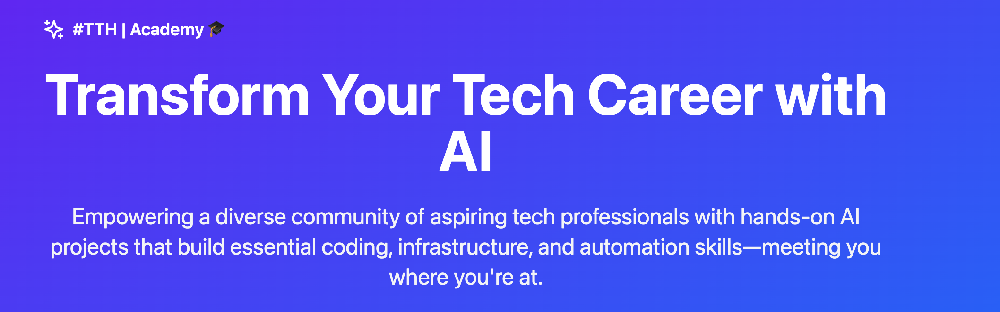

<!-- Banner ASCII art or an imported image -->
<p align="center">
  
</p>

# 🚀 #TTH | Academy 🎓

> **“Code & Culture: A Journey Through AI, Coding, Cloud, Automation & Next-Gen Careers”**  
> Launching Juneteenth 2025 — where liberation meets innovation.

---

## 📖 What Is #TTH Academy?
#TTH Academy is our home for hands-on, project-driven learning—built **for the culture**, by the culture. We’re uniting underrepresented engineers around the world to:
- **Master AI fundamentals & LLMs** through real-world labs
- **Learn Python with AI** with hands-on coding exercises, AI library integrations, and real-world projects
- **Deploy to any Cloud** across cloud infra with modern toolchains
- **Automate, Automate, Automate** with no-code workflows, GitHub best practices, and mentoring
- **Showcase your work and Accelerate your career** in a Capstone week that’s your ticket to the future

---

## 🗺️ Repo Structure

```text
/
├── assets/                    # Images, banners & design files
├── 01_mastering_large_language_models_and_ai_fundamentals/
├── 02_python_programming_for_ai_and_automation/
├── 03_cloud_infrastructure_and_deployment/
├── 04_automation_no_code_tools_and_career_acceleration/
├── 05_capstone_showcase/
└── README.md                  # You are here!
```

---

## 📚 How to Navigate

1. **Explore the Modules**  
   Each `0X_…/` folder holds week-by-week lessons, labs, and mini-projects.

2. **Follow Along**  
   Clone this repo, install dependencies (see each module’s `README.md`), and start coding.

3. **Join the Community**  
   Head over to our Discord/Forum to ask questions, share progress, or offer feedback.

4. **Contribute & Iterate**  
   Found an issue? Have ideas for new labs? Please open a PR—this journey is always evolving.

---

## 🔥 Getting Started

```bash
# 1. Fork or Clone 🚀
git clone https://github.com/thetechhustle/Academy.git
cd Academy

# 2. Choose Your Path 🛤️
cd 01_mastering_large_language_models_and_ai_fundamentals
pip install -r requirements.txt

# 3. Dive In 🏊‍♂️
# Follow the module README to launch notebooks, run demos, and build your AI apps.
```

---

## 🤝 Join the Movement

We’re building **together**—not in isolation.  
- **Webinar Kickoff**: June 19, 2025 (Juneteenth)  
- **Waiting List** & Updates: [Link in repo description]  
- **Community Chat**: [Discord/Slack link]  
- **Office Hours**: Weekly with mentors & industry guests  

> **Liberation through learning. Power through code.**  
> See you in class.  

---

## 📝 License & Code of Conduct

- Licensed under **MIT**.  
- Please read our [Code of Conduct](CODE_OF_CONDUCT.md) before contributing.  

---

<p align="center">
  &copy; 2025 #TheTechHustle • Built with ❤️ for the culture
</p>
